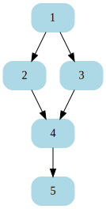
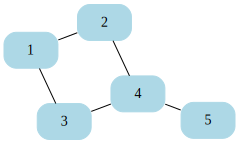
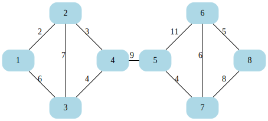
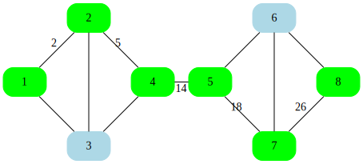

# go-graph

[](https://github.com/dnaeon/go-graph/actions/workflows/test.yaml/badge.svg)
[](https://pkg.go.dev/gopkg.in/dnaeon/go-graph.v1)
[](https://goreportcard.com/report/gopkg.in/dnaeon/go-graph.v1)
[](https://codecov.io/gh/dnaeon/go-graph)

A simple and generic library for working with
[Graphs](https://en.wikipedia.org/wiki/Graph_(discrete_mathematics))
in Go.



## Installation

Executing the following command.

``` shell
go get -v gopkg.in/dnaeon/go-graph.v1
```

## Usage

Consider the following undirected graph.



This snippet creates the graph and performs DFS traversal on it.

``` go
package main

import (
	"fmt"

	"gopkg.in/dnaeon/go-graph.v1"
)

func main() {
	g := graph.New[int](graph.KindUndirected)
	g.AddEdge(1, 2)
	g.AddEdge(1, 3)
	g.AddEdge(2, 4)
	g.AddEdge(3, 4)
	g.AddEdge(4, 5)

	walker := func(v *graph.Vertex[int]) error {
		fmt.Println(v.Value)
		return nil
	}

	fmt.Printf("DFS (pre-order) from (1):\n")
	if err := graph.WalkPreOrderDFS(g, 1, walker); err != nil {
		fmt.Printf("DFS (pre-order): %s\n", err)
	}

	fmt.Printf("\nDFS (pre-order) from (3):\n")
	if err := graph.WalkPreOrderDFS(g, 3, walker); err != nil {
		fmt.Printf("DFS (pre-order): %s\n", err)
	}

	fmt.Printf("\nDFS (post-order) from (1):\n")
	if err := graph.WalkPostOrderDFS(g, 1, walker); err != nil {
		fmt.Printf("DFS (pre-order): %s\n", err)
	}

	fmt.Printf("\nDFS (post-order) from (3):\n")
	if err := graph.WalkPostOrderDFS(g, 3, walker); err != nil {
		fmt.Printf("DFS (post-order): %s\n", err)
	}
}
```

This example creates a directed graph, and then walks over the
vertices in topological order.


``` go
package main

import (
	"fmt"

	"gopkg.in/dnaeon/go-graph.v1"
)

func main() {
	g := graph.New[int](graph.KindDirected)
	g.AddEdge(1, 2)
	g.AddEdge(1, 3)
	g.AddEdge(2, 4)
	g.AddEdge(3, 4)
	g.AddEdge(4, 5)

	walker := func(v *graph.Vertex[int]) error {
		fmt.Println(v.Value)
		return nil
	}

	fmt.Println("Topo order:")
	if err := graph.WalkTopoOrder(g, walker); err != nil {
		fmt.Printf("WalkTopoOrder: %s\n", err)
	}
}
```

Output from above code looks like this.

``` text
Topo order:
5
4
3
2
1
```

Generate the [Dot
representation](https://graphviz.org/doc/info/lang.html) for a graph.

The following code generates the Dot representation of the directed
graph used in the previous example.

``` go
package main

import (
	"fmt"
	"os"

	"gopkg.in/dnaeon/go-graph.v1"
)

func main() {
	g := graph.New[int](graph.KindDirected)
	g.AddEdge(1, 2)
	g.AddEdge(1, 3)
	g.AddEdge(2, 4)
	g.AddEdge(3, 4)
	g.AddEdge(4, 5)

	if err := graph.WriteDot(g, os.Stdout); err != nil {
		fmt.Println(err)
	}
}
```

Consider the following undirected weighted graph. The edges in this
graph represent the distance from vertex to the other.



The following code will print the shortest path between the given
source and destination vertices, then paint the visited vertices in
green, and finally print the Dot representation of the graph.


``` go
package main

import (
	"fmt"
	"os"

	"gopkg.in/dnaeon/go-graph.v1"
)

func main() {
	g := graph.New[int](graph.KindUndirected)
	g.AddWeightedEdge(1, 2, 2)
	g.AddWeightedEdge(1, 3, 6)
	g.AddWeightedEdge(2, 3, 7)
	g.AddWeightedEdge(2, 4, 3)
	g.AddWeightedEdge(3, 4, 4)
	g.AddWeightedEdge(4, 5, 9)
	g.AddWeightedEdge(5, 6, 11)
	g.AddWeightedEdge(5, 7, 4)
	g.AddWeightedEdge(6, 7, 6)
	g.AddWeightedEdge(6, 8, 5)
	g.AddWeightedEdge(7, 8, 8)

	var prev *graph.Vertex[int]
	walker := func(v *graph.Vertex[int]) error {
		// Paint vertices, which form the shortest path in
		// green
		v.DotAttributes["color"] = "green"
		v.DotAttributes["fillcolor"] = "green"

		if prev != nil {
			edge := g.GetEdge(prev.Value, v.Value)
			edge.DotAttributes["label"] = fmt.Sprintf("%d", int(v.DistanceFromSource))
		}

		prev = v

		fmt.Println(v.Value)
		return nil
	}

	fmt.Printf("Shortest path from (1) to (8):\n")
	if err := graph.WalkShortestPath(g, 1, 8, walker); err != nil {
		fmt.Println(err)
	}

	fmt.Printf("\nDot representation of graph:\n\n")
	if err := graph.WriteDot(g, os.Stdout); err != nil {
		fmt.Println(err)
	}
}
```

This is what the shortest path between vertices `(1)` to `(8)` looks
in Dot representation.



Make sure to also check the included [test cases](./graph_test.go) and
[examples](./examples) directory from this repo.

## Tests

Run the tests.

``` shell
make test
```

## License

`go-graph` is Open Source and licensed under the [BSD
License](http://opensource.org/licenses/BSD-2-Clause).
